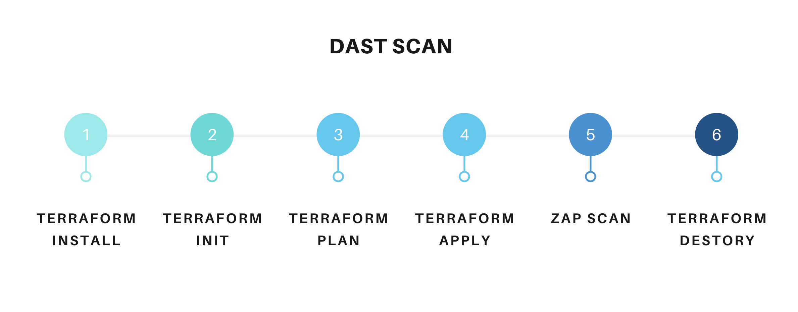
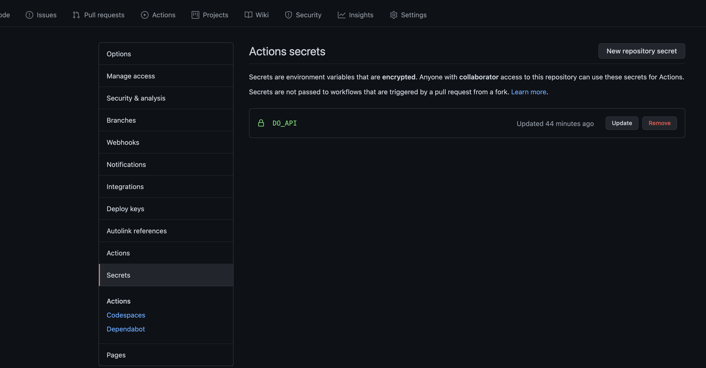
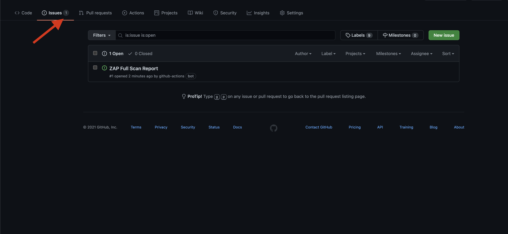

# DAST 


- DAST stands for Dynamic  application security testing 
- It is the  methodology for finding the security flaws in the application when actually running 
- It is **Black-box** Security testing methodology

For performing the DAST I am going to use the ZAP to scan the web-application To provision the Infra I am going to use the Terraform and Spin up the Simple droplet and deploy the application and run the test against it and tear down the Infra structure



## Pre-requisite

Before Implementing the Github Actions there are couple of steps need to be done 

1. Go to the [Digital-Ocean](https://docs.digitalocean.com/reference/api/create-personal-access-token/) and create the Personal token with write access 

Copy the value of the Token  Store it in the **GITHUB_SECRETS**



## Github Actions

```
name: Dast 

on:
  push:

jobs:
  checkout-repo:
    runs-on: ubuntu-latest
    steps:
       - name : Install terraform 
         run : |
          sudo apt-get update && sudo apt-get install -y gnupg software-properties-common curl
          curl -fsSL https://apt.releases.hashicorp.com/gpg | sudo apt-key add -
          sudo apt-add-repository "deb [arch=amd64] https://apt.releases.hashicorp.com $(lsb_release -cs) main"
          sudo apt-get update && sudo apt-get install terraform 
          terraform version 
        
       - name: Checkout 🛎️
         uses: actions/checkout@v2
       - name: Provision the Infra
         run : |
          cd infra 
          sed -i 's/secret/${{ secrets.DO_API}}/g' terraform.tfvars
          cat terraform.tfvars
          ssh-keygen -m PEM -f pentest_key -N ""
          ls 
          terraform init 
          terraform plan 
          terraform apply --auto-approve
          GITHUB_IP=$(terraform output --raw ip_address)
          GITHUB_URL=http://$GITHUB_IP:5050/
          echo "url=$GITHUB_URL"  >> $GITHUB_ENV
       - name: ZAP Scan
         uses: zaproxy/action-full-scan@v0.2.0
         with:
           target: "${{ env.url }}"

       - name: Destory
         if: ${{ always() }}
         run : | 
            terraform destroy --auto-approve           
```

The result can be found under the **Result** section 


## References

1. https://github.com/marketplace/actions/owasp-zap-full-scan
2. https://github.com/salecharohit/do-pentest